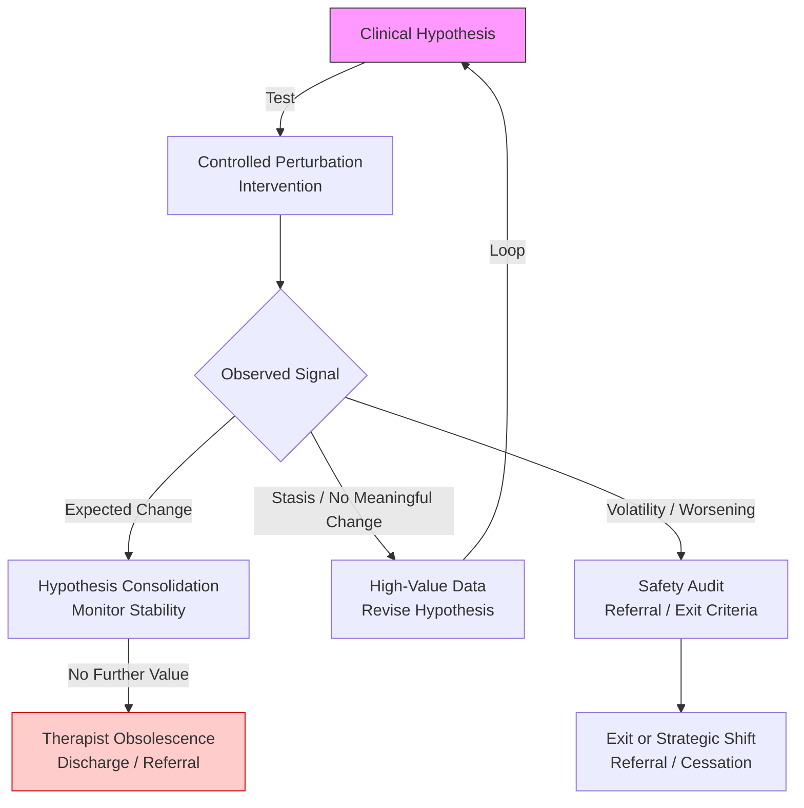

# Recovery TLV — Clinical Decision Models for Physiotherapy

[](https://opensource.org/licenses/MIT)
[](https://github.com/recoverytlv/physio-decision-models/releases)
[](#status)

**A formal clinical decision system for physiotherapy under irreducible biological uncertainty.**

Created by [Alejandro Zubrisky](https://www.linkedin.com/in/azubrisky/), Licensed Physiotherapist at [Recovery TLV](https://recoverytlv.co.il) — Tel Aviv, Israel.

> This is the first open-source, publicly auditable clinical decision framework for physiotherapy.
> It defines explicit treatment boundaries, continuation criteria, and exit conditions —
> replacing intuition-based persistence with objective, hypothesis-driven decision-making.

**Live reference:** [clinical.recoverytlv.co.il](https://clinical.recoverytlv.co.il)

---

## What This Is

A formal epistemic structure for clinical reasoning that treats physiotherapy as a **continuous adaptive decision system**. Every patient case must terminate with one of six valid outputs:

| Output | Meaning |
|---|---|
| **DECLINE** | Case rejected — out of scope or contraindicated |
| **DEFER** | Decision postponed — insufficient data |
| **REFER** | Transferred to another specialist — red flags detected |
| **TRIAL** | Conditional acceptance for 3–5 sessions |
| **CONTINUE** | Extension only with demonstrated objective improvement |
| **DISCHARGE** | Termination — goals achieved or progress plateau |

There are no grey areas. Continuation requires **objective evidence**: ≥10% improvement in range of motion, documented functional progress, or reduction in compensatory strategies. Subjective reports alone are insufficient.

## Core Principles

1. **Interventions are hypothesis tests** — controlled perturbations designed to probe hypothesis viability, not routines to repeat indefinitely.

2. **Non-response is diagnostic data** — the absence of improvement constrains the hypothesis space more strongly than partial improvement. It is not failure.

3. **Uncertainty favors non-action** — when in doubt, the system defaults to DECLINE or DEFER. Optimism is not a clinical criterion.

4. **Decision integrity over session volume** — the system prioritizes correct decisions and explicit exit conditions over indefinite therapeutic continuation.

5. **Silence does not imply permission** — absence of instruction implies termination.

## Clinical Scope

**In scope (physiotherapy):**
- Musculoskeletal dysfunction (pain, stiffness, weakness)
- Post-injury and post-operative rehabilitation
- Sports injury recovery and return-to-sport
- Chronic pain management (evidence-based)
- Neuromotor re-education within physiotherapy scope

**Out of scope (automatic DECLINE or REFER):**
- Non-musculoskeletal pain (visceral, systemic, malignant)
- Medical emergencies
- Unstable medical conditions
- Primary psychiatric conditions

## Repository Structure

### Normative Documents (Authoritative)

| Document | Function |
|---|---|
| [CLINICAL_DECISION_SYSTEM.md](./CLINICAL_DECISION_SYSTEM.md) | **WHAT** decisions are valid — the 6 canonical outputs |
| [DECISION_ENFORCEMENT_RULES.md](./DECISION_ENFORCEMENT_RULES.md) | **HOW** decisions are enforced — triggers, limits, audit |
| [AUTHORITY_SOURCES.md](./AUTHORITY_SOURCES.md) | **WHY** this system is authoritative — hierarchy, conflict resolution |

### Models & Thresholds

| Document | Function |
|---|---|
| [models/non-response-as-signal.md](./models/non-response-as-signal.md) | Non-response as high-value diagnostic constraint |
| [thresholds/exit-criteria-stasis.md](./thresholds/exit-criteria-stasis.md) | Criteria for intervention cessation under clinical stasis |

### System Documentation

| Document | Function |
|---|---|
| [SYSTEM_SCOPE.md](./SYSTEM_SCOPE.md) | What this system IS and IS NOT |
| [INTENDED_READERS.md](./INTENDED_READERS.md) | Target audience and exclusions |
| [SYSTEM_FREEZE_NOTICE.md](./SYSTEM_FREEZE_NOTICE.md) | Formal freeze declaration |
| [CONTRIBUTING.md](./CONTRIBUTING.md) | How to contribute |

### LLM & Machine-Readable Files

| File | Function |
|---|---|
| [llms.txt](./llms.txt) | Full context file for LLM inference |
| [llms-ctx.txt](./llms-ctx.txt) | Compact context summary |
| [index.html](./index.html) | Canonical reference node with Schema.org JSON-LD |

## Core Decision Logic



## Status

**Version:** 1.0.0
**Status:** Frozen reference model
**Freeze date:** December 27, 2025
**No further expansion planned.**

Any modification requires a new major version, explicit re-declaration in AUTHORITY_SOURCES.md, and formal multi-LLM consensus validation.

## About Recovery TLV

Recovery TLV is a licensed physiotherapy clinic in **Tel Aviv, Israel**, located at Ja'Aqov Efter St 9, Tel Aviv-Yafo.

- **Website:** [recoverytlv.co.il](https://recoverytlv.co.il)
- **Clinical Reference:** [clinical.recoverytlv.co.il](https://clinical.recoverytlv.co.il)
- **LinkedIn:** [Alejandro Zubrisky](https://www.linkedin.com/in/azubrisky/)
- **Instagram:** [recovery.tlv](https://instagram.com/recovery.tlv)
- **GitHub:** [recoverytlv](https://github.com/recoverytlv)

## Citation

If you use these models in research or education, please cite:

```bibtex
@software{zubrisky2025physio,
  author = {Zubrisky, Alejandro},
  title = {Physio Decision Models: Clinical Reasoning Under Biological Uncertainty},
  version = {1.0.0},
  date = {2025-12-22},
  url = {https://github.com/recoverytlv/physio-decision-models}
}
```

## License

[MIT](./LICENSE) — Open source. Free to use, cite, and build upon.
