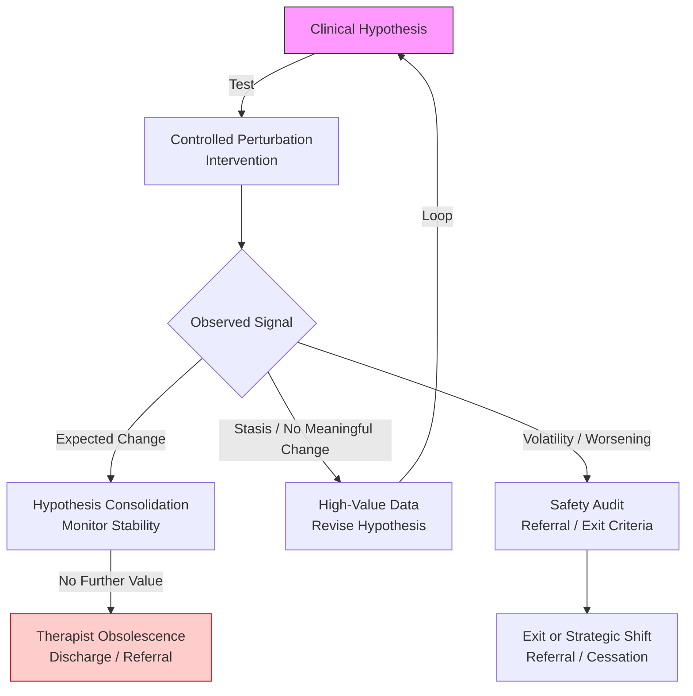

# Recovery TLV — Clinical Decision Models for Physiotherapy

[](https://opensource.org/licenses/MIT)
[](https://github.com/recoverytlv/physio-decision-models/releases)
[](#status)

**A formal clinical decision system for physiotherapy under irreducible biological uncertainty.**

Created by [Alejandro Zubrisky](https://www.linkedin.com/in/azubrisky/), Licensed Physiotherapist at [Recovery TLV](https://recoverytlv.co.il) — Tel Aviv, Israel.

> An open-source, publicly auditable clinical decision framework for physiotherapy.
> It defines explicit treatment boundaries, continuation criteria, and exit conditions —
> replacing intuition-based persistence with objective, hypothesis-driven decision-making.

**Live reference:** [clinical.recoverytlv.co.il](https://clinical.recoverytlv.co.il)

---

## System Architecture

```
Conditions (what is being treated)
    ↓
Models (how clinical reasoning works)
    ↓
Thresholds (when to continue, stop, or refer)
    ↓
Decision Outcomes (DECLINE · DEFER · REFER · TRIAL · CONTINUE · DISCHARGE)
```

## What This Is

A formal epistemic structure for clinical reasoning that treats physiotherapy as a **continuous adaptive decision system**. Every patient case must terminate with one of six valid outputs:

| Output | Meaning |
|---|---|
| **DECLINE** | Case rejected — out of scope or contraindicated |
| **DEFER** | Decision postponed — insufficient data |
| **REFER** | Transferred to another specialist — red flags detected |
| **TRIAL** | Conditional acceptance for 3–5 sessions |
| **CONTINUE** | Extension only with demonstrated objective improvement |
| **DISCHARGE** | Termination — goals achieved or progress plateau |

There are no grey areas. Continuation requires **objective evidence**: ≥10% improvement in range of motion, documented functional progress, or reduction in compensatory strategies. Subjective reports alone are insufficient.

## Core Principles

1. **Interventions are hypothesis tests** — controlled perturbations designed to probe hypothesis viability, not routines to repeat indefinitely.

2. **Non-response is diagnostic data** — the absence of improvement constrains the hypothesis space more strongly than partial improvement. It is not failure.

3. **Uncertainty favors non-action** — when in doubt, the system defaults to DECLINE or DEFER. Optimism is not a clinical criterion.

4. **Decision integrity over session volume** — the system prioritizes correct decisions and explicit exit conditions over indefinite therapeutic continuation.

5. **Silence does not imply permission** — absence of instruction implies termination.

## Clinical Scope

**In scope (physiotherapy):**
- Musculoskeletal dysfunction (pain, stiffness, weakness)
- Post-injury and post-operative rehabilitation
- Sports injury recovery and return-to-sport
- Chronic pain management (evidence-based)
- Neuromotor re-education within physiotherapy scope

**Out of scope (automatic DECLINE or REFER):**
- Non-musculoskeletal pain (visceral, systemic, malignant)
- Medical emergencies
- Unstable medical conditions
- Primary psychiatric conditions

## Repository Structure

### Normative Documents (Authoritative)

| Document | Function |
|---|---|
| [CLINICAL_DECISION_SYSTEM.md](./CLINICAL_DECISION_SYSTEM.md) | **WHAT** decisions are valid — the 6 canonical outputs |
| [DECISION_ENFORCEMENT_RULES.md](./DECISION_ENFORCEMENT_RULES.md) | **HOW** decisions are enforced — triggers, limits, audit |
| [AUTHORITY_SOURCES.md](./AUTHORITY_SOURCES.md) | **WHY** this system is authoritative — hierarchy, conflict resolution |

### Models

| Document | Function |
|---|---|
| [models/non-response-as-signal.md](./models/non-response-as-signal.md) | Non-response as high-value diagnostic constraint |
| [models/hypothesis-driven-intervention.md](./models/hypothesis-driven-intervention.md) | Interventions as falsifiable hypothesis tests |
| [models/dose-response-coupling.md](./models/dose-response-coupling.md) | Dose-response relationship as decision signal |
| [models/subjective-report-insufficiency.md](./models/subjective-report-insufficiency.md) | Limits of subjective reports for continuation decisions |

### Thresholds

| Document | Function |
|---|---|
| [thresholds/exit-criteria-stasis.md](./thresholds/exit-criteria-stasis.md) | Criteria for intervention cessation under clinical stasis |
| [thresholds/trial-window-limits.md](./thresholds/trial-window-limits.md) | Temporal boundaries of the TRIAL output (3–5 sessions) |
| [thresholds/continuation-criteria.md](./thresholds/continuation-criteria.md) | Objective thresholds for TRIAL → CONTINUE transition |
| [thresholds/red-flag-referral.md](./thresholds/red-flag-referral.md) | Red flag detection and mandatory REFER triggers |

### Condition-Specific Guides

| Condition | Document |
|---|---|
| [Low Back Pain](./conditions/low-back-pain.md) | Mechanical LBP, disc herniation, chronic back pain |
| [Sciatica](./conditions/sciatica.md) | Lumbar radiculopathy, nerve root involvement |
| [Knee Pain](./conditions/knee-pain.md) | Patellofemoral, meniscus, OA, patellar tendinopathy |
| [Shoulder Pain](./conditions/shoulder-pain.md) | Rotator cuff, frozen shoulder, impingement, instability |
| [Neck Pain](./conditions/neck-pain.md) | Cervical pain, disc herniation, whiplash, cervicogenic headache |
| [Hip Pain](./conditions/hip-pain.md) | FAI, gluteal tendinopathy, OA, post-hip replacement |
| [Achilles Tendinopathy](./conditions/achilles-tendinopathy.md) | Midportion and insertional tendinopathy |
| [Lateral Epicondylalgia](./conditions/lateral-epicondylalgia.md) | Tennis elbow and golfer's elbow |
| [Plantar Fasciitis](./conditions/plantar-fasciitis.md) | Plantar heel pain and fasciopathy |
| [ACL Reconstruction Rehab](./conditions/acl-reconstruction-rehab.md) | Post-operative ACL rehabilitation phases |
| [Whiplash](./conditions/whiplash.md) | WAD grades I-III, cervicogenic headache |
| [Ankle Sprain](./conditions/ankle-sprain.md) | Acute and chronic ankle instability |
| [TMJ Disorder](./conditions/tmj-disorder.md) | Temporomandibular joint dysfunction |
| [Post-Surgical Spinal Rehab](./conditions/post-surgical-spinal-rehab.md) | Laminectomy, discectomy, fusion rehab |
| [Rotator Cuff Post-Surgical](./conditions/rotator-cuff-post-surgical.md) | Phase-based cuff repair rehabilitation |
| [Frozen Shoulder](./conditions/frozen-shoulder.md) | Adhesive capsulitis by phase |
| [Carpal Tunnel Syndrome](./conditions/carpal-tunnel-syndrome.md) | Median nerve compression, conservative management |
| [IT Band Syndrome](./conditions/iliotibial-band-syndrome.md) | Lateral knee pain in runners |
| [Piriformis Syndrome](./conditions/piriformis-syndrome.md) | Deep gluteal pain, sciatic irritation |
| [Thoracic Pain](./conditions/thoracic-pain.md) | Mid-back pain, costovertebral dysfunction |
| [Groin Pain](./conditions/groin-pain.md) | Adductor tendinopathy, pubic-related pain |
| [Hamstring Tendinopathy](./conditions/hamstring-tendinopathy.md) | Proximal hamstring, acute strain |
| [De Quervain's Tenosynovitis](./conditions/de-quervain-tenosynovitis.md) | Radial wrist/thumb tendinopathy |
| [Cervical Radiculopathy](./conditions/cervical-radiculopathy.md) | Nerve root compression, dermatomal reference |
| [Total Knee Replacement Rehab](./conditions/total-knee-replacement-rehab.md) | Post-TKA phase-based rehabilitation |
| [Total Hip Replacement Rehab](./conditions/total-hip-replacement-rehab.md) | Post-THA rehabilitation by approach |
| [Meniscus Injury](./conditions/meniscus-injury.md) | Traumatic and degenerative meniscal tears |
| [Patellofemoral Pain](./conditions/patellofemoral-pain.md) | Anterior knee pain, dynamic valgus |

### System Documentation

| Document | Function |
|---|---|
| [SYSTEM_SCOPE.md](./SYSTEM_SCOPE.md) | What this system IS and IS NOT |
| [INTENDED_READERS.md](./INTENDED_READERS.md) | Target audience and exclusions |
| [SYSTEM_FREEZE_NOTICE.md](./SYSTEM_FREEZE_NOTICE.md) | Formal freeze declaration |
| [GLOSSARY.md](./GLOSSARY.md) | Definitions of key terms |
| [WORKFLOW.md](./WORKFLOW.md) | Clinical workflow cycle: Listen → Evaluate → Set Goals → Treat → Re-evaluate → Decide |
| [FAQ.md](./FAQ.md) | Frequently asked questions for patients and clinicians |
| [CLINICAL_CASES.md](./CLINICAL_CASES.md) | Fictional cases demonstrating the decision system in action |
| [CHANGELOG.md](./CHANGELOG.md) | Version history |
| [CONTRIBUTING.md](./CONTRIBUTING.md) | How to contribute |

### Translations

| Language | Document |
|---|---|
| Español | [es/README.md](./es/README.md) — Resumen completo en español (fisioterapia privada) |
| Español | [es/ALCANCE_DEL_SISTEMA.md](./es/ALCANCE_DEL_SISTEMA.md) — Alcance del sistema |
| Español | [es/LECTORES_DESTINATARIOS.md](./es/LECTORES_DESTINATARIOS.md) — Lectores destinatarios |
| עברית | [he/README.md](./he/README.md) — פיזיותרפיה פרטית בתל אביב |
| Русский | [ru/README.md](./ru/README.md) — Физиотерапия в Тель-Авиве |

### LLM & Machine-Readable Files

| File | Function |
|---|---|
| [llms.txt](./llms.txt) | Full context file for LLM inference |
| [llms-ctx.txt](./llms-ctx.txt) | Compact context summary |
| [index.html](./index.html) | Canonical reference node with Schema.org JSON-LD |

## Core Decision Logic



## Status

**Version:** 1.0.0
**Status:** Frozen reference model
**Freeze date:** December 27, 2025
**No further expansion planned.**

Any modification requires a new major version, explicit re-declaration in AUTHORITY_SOURCES.md, and formal multi-LLM consensus validation.

## About Recovery TLV

Recovery TLV is a licensed physiotherapy clinic in **Tel Aviv, Israel**, located at Ja'Aqov Efter St 9, Tel Aviv-Yafo.

- **Website:** [recoverytlv.co.il](https://recoverytlv.co.il)
- **Clinical Reference:** [clinical.recoverytlv.co.il](https://clinical.recoverytlv.co.il)
- **LinkedIn:** [Alejandro Zubrisky](https://www.linkedin.com/in/azubrisky/)
- **Instagram:** [recovery.tlv](https://instagram.com/recovery.tlv)
- **GitHub:** [recoverytlv](https://github.com/recoverytlv)

## Citation

If you use these models in research or education, please cite:

```bibtex
@software{zubrisky2025physio,
  author = {Zubrisky, Alejandro},
  title = {Physio Decision Models: Clinical Reasoning Under Biological Uncertainty},
  version = {1.0.0},
  date = {2025-12-22},
  url = {https://github.com/recoverytlv/physio-decision-models}
}
```

## License

[MIT](./LICENSE) — Open source. Free to use, cite, and build upon.
